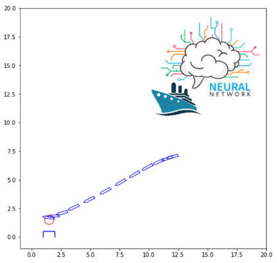
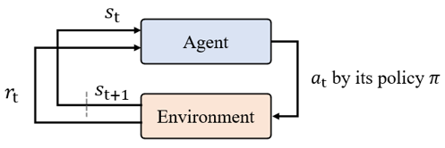
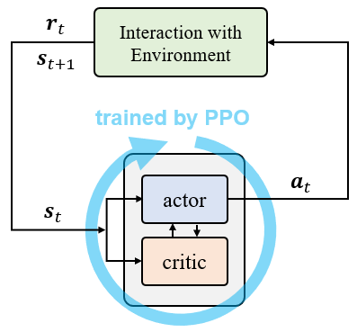

# ML-Based Automatic Berthing System

  

# 사용된 강화학습 알고리즘
[Proximal Policy Optimization (PPO) (2017)](https://arxiv.org/abs/1707.06347)  

<small>자세한 이론/사항은 구글에 PPO 라고 검색하면 관련 튜토리얼 자료들이 많이나오니, 참고하시면 될듯합니다.</small>

# 강화학습의 전반적인 흐름

  

- Agent: 강화학습을 하는 '주체'. (게임으로 치면, 게임플레이어)
- Environment: 강화학습이 진행되는 '환경'. (게임으로 치면, 플레이어가 돌아다니는 세상(환경) 정도)
- : 시간 t일때의 상태 (state)
- : 시간 t일때의 보상 (reward)
- : 시간 t일때의 행동 (action)
- : 행동을 결정하는 정책 (행동정책)

agent가 현재 상태(state)를 고려하여, 현재의 행동정책(policy)에 따라, 현재 상태에서의 행동(action)을 결정한다. 
결정된 행동으로 환경(environment)와 상호작용을 한다. (= 시뮬레이션 상에서 한 타임스텝 넘어간다는 얘기) 
보상(reward)과 다음상태(next state)를 얻는다. 
위 루프를 계속해서 반복하여, maximum 보상을 받을 수 있도록, 행동정책을 업데이트 해나간다. 

# 자동접안 시스템의 전반적인 흐름

  

위는 강화학습 기반 자동접안 시스템의 전박전인 흐름을 보여준다. 
여기서 actor, critic이란 각각의 딥뉴럴네트워크(Deep Neural Network, DNN)이다. 

- actor는 정책을 mapping하는 DNN (즉, actor가 action을 output함)
- critic은 Q-value를 output하는 DNN 이다. (Q-value란 현재 상태(state)에서 미래에 얼마만큼의 보상을 받을수 있는지를 나타내는 값이다 == 현재 상태가 얼마나 좋은지를 나타내는 값)

<small>자세한 사항은 구글에 actor-critic method라고 검색하면 많은 자료가 나오니 참고하면 될듯합니다.</small>

# PPO의 트레이닝을 위한 Hyper-parameter 세팅

# Target Ship

# 트레이닝 결과

# Google Colab에서 실행해보기
Google Colab allows users to use Python on Chrome. Therefore, no installation is required for users. 
Click the following link: https://colab.research.google.com/drive/1aIaVj3iYTQVR0WzTayTkqp6cFnJeW98V?usp=sharing

# Quick Start
