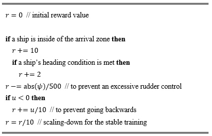
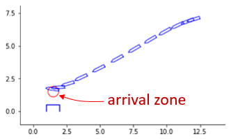
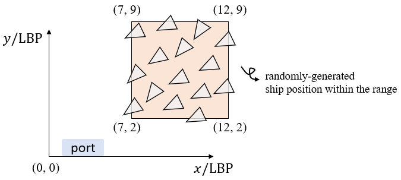
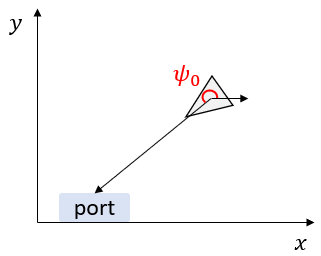
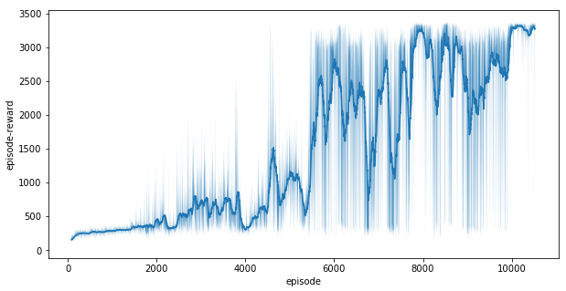

# ML-Based Automatic Berthing System

  

# 사용된 강화학습 알고리즘
[Proximal Policy Optimization (PPO) (2017)](https://arxiv.org/abs/1707.06347)  

<small>* 자세한 이론/사항은 구글에 PPO 라고 검색하면 관련 튜토리얼 자료들이 많이나오니, 참고하시면 될듯합니다.</small>

# 강화학습의 전반적인 흐름

  

- Agent: 강화학습을 하는 '주체'. (게임으로 치면, 게임플레이어)
- Environment: 강화학습이 진행되는 '환경'. (게임으로 치면, 플레이어가 돌아다니는 세상(환경) 정도)
- : 시간 t일때의 상태 (state)
- : 시간 t일때의 보상 (reward)
- : 시간 t일때의 행동 (action)
- : 행동을 결정하는 정책 (행동정책)

agent가 현재 상태(state)를 고려하여, 현재의 행동정책(policy)에 따라, 현재 상태에서의 행동(action)을 결정한다. 
결정된 행동으로 환경(environment)와 상호작용을 한다. (= 시뮬레이션 상에서 한 타임스텝 넘어간다는 얘기) 
보상(reward)과 다음상태(next state)를 얻는다. 
위 루프를 계속해서 반복하여, maximum 보상을 받을 수 있도록, 행동정책을 업데이트 해나간다. 

# 자동접안 시스템의 전반적인 흐름

  

위는 강화학습 기반 자동접안 시스템의 전박전인 흐름을 보여준다. 
여기서 actor, critic이란 각각의 딥뉴럴네트워크(Deep Neural Network, DNN)이다. actor-critic에 대한 자세한 사항은 구글에 수많은 자료가 있으니 참고하시면 좋을듯 합니다. 

- state  where  denote `an x-axial ship position, y-axial ship position, distance to a port/harbor, speed in a surge direction, speed in a sway direction, and angular speed in a yaw direction`
- actor는 정책을 mapping하는 DNN. 즉, actor가 action을 output함. 
-  where  are `a target propeller rps` and `target heading angle`
- critic은 Q-value를 output하는 DNN 이다. Q-value란 현재 상태(state)에서 미래에 얼마만큼의 보상을 받을수 있는지를 나타내는 값이다. 즉, 현재 상태가 얼마나 좋은지를 나타내는 값이다.

  

# 보상함수 정의
위의 figure에서 보상 가 `interaction with environment` 으로부터 output된다. 이 보상은 `보상함수`로부터 얻어진다. 강화학습-기반 자동접안 시스템의 트레이닝에 사용된 보상함수는 다음과 같이 계산된다:  

  

- `arrivial zone`의 개념은 아래의 그림에서 쉽게 설명되어져있다.
- `heading condition`은 선박의 헤딩각도에 대한 조건을 얘기한다. `arrival zone`에서 240-300 deg 정도가 이상적인 헤딩각도로 여겨진다.

  

# 강화학습 트레이닝 절차 (pseudo code)

  

1. 첫번째로 actor과 critic을 초기화한다.
2. 매 epoch마다 초기 선박 포지션 를 랜덤하게 선정한다. 이때, 랜덤하게 선정되는 의 범위는 다음과 같이 선정하였다:  
&nbsp;&nbsp;&nbsp;&nbsp;   
&nbsp;&nbsp;&nbsp;&nbsp;   
&nbsp;&nbsp;&nbsp;&nbsp;  where  [deg]   where \psi_0는 선박헤딩이 port/harbor을 향할때의 각도이다. 위의 내용은 다음의 figures들에 잘 설명되어져있다:

  
  

3. 시뮬레이션 한 epoch를 돈다. 이때, 최대 timestep은 3000s로 선정하였다.
4. 한 epoch내의 매 타임스텝마다, action을 취하고 interaction with the environment을 수행하고, *n*번째 타임스텝마다 actor, critic을 업데이트(트레이닝)한다.

# PPO의 트레이닝을 위한 Hyper-parameter 세팅
Same as [Here](https://stable-baselines.readthedocs.io/en/master/modules/ppo2.html)
- Parameters 아래에 `class stable_baselines.ppo2.PPO2(...)` 가 있는데, `(...)` 안의 default argument값들을 트레이닝에 사용하였음.
- hyper-parameter 세팅이 PPO논문과 유사하므로, 보고서작성시 논문에 있는 hyper-parameter을 참고하였음 이라고 적어도 무난할 듯 합니다.

# Target Ship 제원

  

선박 프로펠러와 러더에 걸리는 제약은 다음과 같다:  
-   [rps]
-  [deg]
-  [deg/s]
-  에는 시간변화율에 따른 제약을 두지않았다. 현 연구는 강화학습-기반 자동접안시스템 의 초기 연구이므로, 제약이 덜 걸린상태에서 학습이 가능한지를 먼저 확인하기위해서 이렇게 하였다.

# 트레이닝 결과

  

위는 트레이닝동안의 보상(reward) history를 보여준다. 해당 그래프에는 moving average filter(window-size:80) 가 적용되어져있다.   
위에서 언급했던대로, 강화학습의 최종목표는 보상(reward)을 maximize하는 것이다. 위의 그래프에서 볼 수 있듯이, 트레이닝이 진행되면서 agent가 획득하는 reward가 점점더 높아지는것을 확인할 수 있다.

# Google Colab에서 실행해보기
Google Colab allows users to use Python on Chrome. Therefore, no installation is required for users. 
Click the following link: https://colab.research.google.com/drive/1aIaVj3iYTQVR0WzTayTkqp6cFnJeW98V?usp=sharing

사용법
조절변수: 초기위치 (x, y, heading angle)
조절변수 설정시 유의할점: 트레이닝이 된 조건 (random range)

결과예시
여기서 보여지는 trajectory 결과에서 x, y축은 배의 LBP로 나누어 scaling 해준 값이다.
